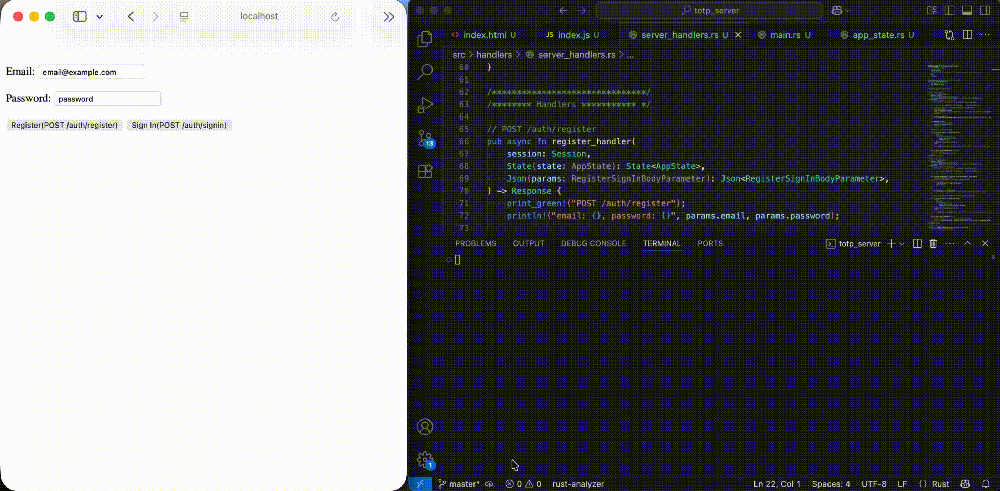
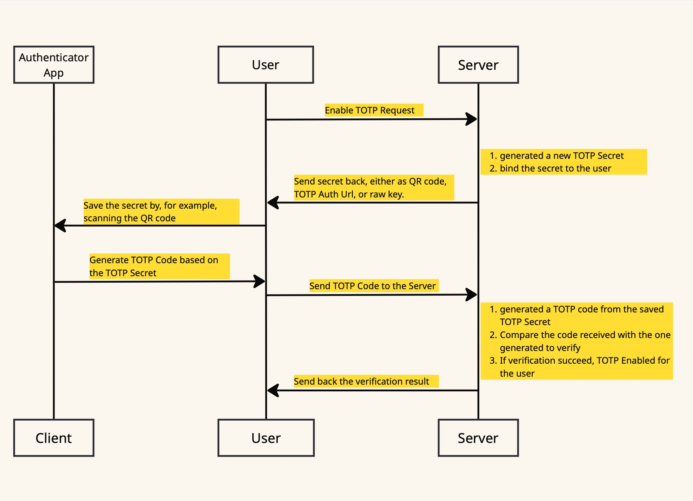
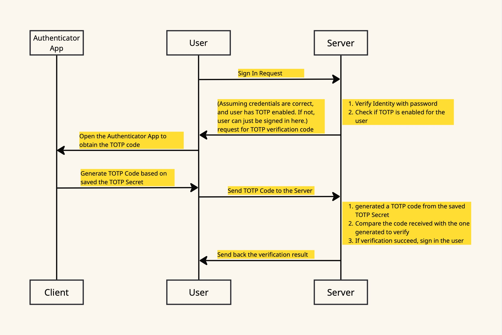

# Rust/Axum: TOTP-based Two Factor Authentication (2FA) Server

A demo on implementing Time-based One time password (TOTP)-based Two Factor Authentication (2FA) Server
using Rust/Axum.

## Endpoints
Specifically, this demo includes the following endpoints for server implementations.

- POST /auth/register: sign up new user
- POST /auth/signin: sign in existing user
- GET /auth/signout: sign out
- ⭐GET /auth/otp/enable: enable TOTP-based 2FA.
- GET /auth/otp/disable: disable TOTP-based 2FA
- ⭐POST /auth/otp/verify: verify TOTP code generated by authenticator apps

In addition, to demonstrate how and when the server handlers can be called from frontend applications, there are also the following endpoints serving a simple HTML/Javscript based frontend.

- GET /index.html
- GET /index.js

## Important TOTP Flows

### Enable TOTP Based 2FA Flow

### Sign In Flow

## Start Server
To test out the server as well as the frontends,
- run `Cargo run` from the termial. This will start the server listen to port `3000`.
- To check out the flow with the frontend provided, Open a browser and navigate to `http://localhost:3000/index.html`

For more details, please check out my blog:
[Rust/Axum: TOTP-based Two Factor Authentication (2FA) Server]()